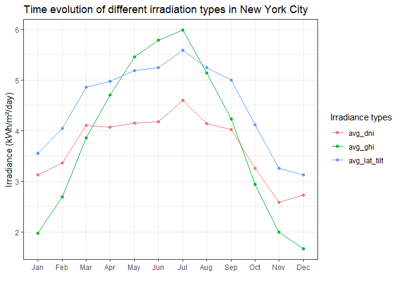

Fetching Web Data using API
================

### Introduction

In data science projects, it often happens that needed data is not
available locally (for example, in databases or data files such as CSV).
In this case, one good option is to get data online using API
(Application Programming Interface) or web scraping. The aim of this
project is to use the former method to retrieve data on the web.  
The API we’ll work with comes from
[DATA.GOV](https://api.data.gov/docs/), which is a website providing US
Government’s open data. We want to extract the [Solar Resource
Data](https://developer.nrel.gov/docs/solar/solar-resource-v1/) which
contains various types of solar data for a given location, in our case
for New York city. The output fields, in kWh/m²/day (kilowatt hours per
square meter per day) are as follows:

  - avg\_dni: Average Direct Normal Irradiance representing the amount
    of solar radiation arriving perpendicularly on a surface per unit
    area.
  - avg\_ghi: Average Global Horizontal Irradiance representing the
    amount of solar radiation received by a surface horizontal to the
    ground.
  - avg\_lat\_tilt: Average Tilt at Latitude representing the amount of
    radiation a surface receives per unit area that doesn’t arrive on a
    direct path from the sun.

Before starting, let’s first import the libraries we’ll need for this
project.

``` r
library(httr)     # for querying the API
library(jsonlite) # for converting from json to R dataframe
library(purrr)    # for manipulating lists
library(dplyr)    # for manipulating dataframes
library(tidyr)    # for tidying dataframes including pivoting tasks
library(ggplot2)  # for data visualization tasks
```

### Suitable Endpoint and Parameters to Query the API

Looking at the API’s
[documentation](https://developer.nrel.gov/docs/solar/solar-resource-v1/),
we can see that the API structure is
`/api/solar/solar_resource/v1.format?parameters`. However, from the
[documentation](https://developer.nrel.gov/docs/api-key/) on the API key
usage, one can notice that `https://developer.nrel.gov` should also be
part of the API. So, the complete API structure is
`https://developer.nrel.gov/api/solar/solar_resource/v1.format?parameters`.
The format we want for the query response is `json`. The parameters
we’ll provide for our request are `api_key`as well as `lat` (latitude)
and `lon` (longitude) of New York City. For querying the API, we’ll use
the `GET` function from the `httr` library. This function requires among
others the parameters to be passed as a list. So, let’s create a list of
the request parameters.

``` r
params = list(api_key = mykey,
              lat = 41,
              lon = -75
              )
```

The code chunk where I assigned my API key to the variable `mykey` is
not included in the rendered R Markdown file to keep the key secret.  
Let’s move on now to querying the API.

### Extracting the New York City Solar Resource Data

Here is where we make use of the `GET` function from `httr` to retrieve
the solar resource data of New York City. To track potential errors,
we’ll display the response’s status code and format.

``` r
url <- "https://developer.nrel.gov/api/solar/solar_resource/v1.json"
response <- GET(url, query = params)

status <- paste("status code: ",
                status_code(response)
                )
format <- paste("response_format: ",
                http_type(response)
                )
```

    ## [1] "status code:  200"

    ## [1] "response_format:  application/json"

We can see that the status code is 200, meaning that our query was
successful. Also, the format of the response is, as expected, json. Now
that we know our request got an error-free response, let’s extract the
content as text and display it.

``` r
json_text <- content(response,as = "text")
json_text
```

    ## [1] "{\"version\":\"1.0.0\",\"warnings\":[],\"errors\":[],\"metadata\":{\"sources\":[\"Perez-SUNY/NREL, 2012\"]},\"inputs\":{\"lat\":\"41\",\"lon\":\"-75\"},\"outputs\":{\"avg_dni\":{\"annual\":3.69,\"monthly\":{\"jan\":3.12,\"feb\":3.36,\"mar\":4.1,\"apr\":4.07,\"may\":4.15,\"jun\":4.17,\"jul\":4.6,\"aug\":4.14,\"sep\":4.02,\"oct\":3.26,\"nov\":2.58,\"dec\":2.72}},\"avg_ghi\":{\"annual\":3.87,\"monthly\":{\"jan\":1.97,\"feb\":2.69,\"mar\":3.86,\"apr\":4.7,\"may\":5.45,\"jun\":5.78,\"jul\":5.98,\"aug\":5.14,\"sep\":4.23,\"oct\":2.94,\"nov\":1.99,\"dec\":1.67}},\"avg_lat_tilt\":{\"annual\":4.52,\"monthly\":{\"jan\":3.55,\"feb\":4.04,\"mar\":4.86,\"apr\":4.97,\"may\":5.18,\"jun\":5.24,\"jul\":5.58,\"aug\":5.24,\"sep\":5.0,\"oct\":4.11,\"nov\":3.26,\"dec\":3.13}}}}"

We can confirm that we got the data we needed, however the output in the
current format is somewhat difficult to read and work with. Therefore,
we’ll need to convert this output into an R object we can easily read
and handle.

### Parsing the JSON into an R object.

To do this, we’ll resort to the `fromJSON` function from the `jsonlite`
library. We’ll also display the structure of the new R object to better
understand how to manipulate it to get the data we’re interested in.

``` r
json_lists <- fromJSON(json_text)

str(json_lists)
```

    ## List of 6
    ##  $ version : chr "1.0.0"
    ##  $ warnings: list()
    ##  $ errors  : list()
    ##  $ metadata:List of 1
    ##   ..$ sources: chr "Perez-SUNY/NREL, 2012"
    ##  $ inputs  :List of 2
    ##   ..$ lat: chr "41"
    ##   ..$ lon: chr "-75"
    ##  $ outputs :List of 3
    ##   ..$ avg_dni     :List of 2
    ##   .. ..$ annual : num 3.69
    ##   .. ..$ monthly:List of 12
    ##   .. .. ..$ jan: num 3.12
    ##   .. .. ..$ feb: num 3.36
    ##   .. .. ..$ mar: num 4.1
    ##   .. .. ..$ apr: num 4.07
    ##   .. .. ..$ may: num 4.15
    ##   .. .. ..$ jun: num 4.17
    ##   .. .. ..$ jul: num 4.6
    ##   .. .. ..$ aug: num 4.14
    ##   .. .. ..$ sep: num 4.02
    ##   .. .. ..$ oct: num 3.26
    ##   .. .. ..$ nov: num 2.58
    ##   .. .. ..$ dec: num 2.72
    ##   ..$ avg_ghi     :List of 2
    ##   .. ..$ annual : num 3.87
    ##   .. ..$ monthly:List of 12
    ##   .. .. ..$ jan: num 1.97
    ##   .. .. ..$ feb: num 2.69
    ##   .. .. ..$ mar: num 3.86
    ##   .. .. ..$ apr: num 4.7
    ##   .. .. ..$ may: num 5.45
    ##   .. .. ..$ jun: num 5.78
    ##   .. .. ..$ jul: num 5.98
    ##   .. .. ..$ aug: num 5.14
    ##   .. .. ..$ sep: num 4.23
    ##   .. .. ..$ oct: num 2.94
    ##   .. .. ..$ nov: num 1.99
    ##   .. .. ..$ dec: num 1.67
    ##   ..$ avg_lat_tilt:List of 2
    ##   .. ..$ annual : num 4.52
    ##   .. ..$ monthly:List of 12
    ##   .. .. ..$ jan: num 3.55
    ##   .. .. ..$ feb: num 4.04
    ##   .. .. ..$ mar: num 4.86
    ##   .. .. ..$ apr: num 4.97
    ##   .. .. ..$ may: num 5.18
    ##   .. .. ..$ jun: num 5.24
    ##   .. .. ..$ jul: num 5.58
    ##   .. .. ..$ aug: num 5.24
    ##   .. .. ..$ sep: num 5
    ##   .. .. ..$ oct: num 4.11
    ##   .. .. ..$ nov: num 3.26
    ##   .. .. ..$ dec: num 3.13

We can see that the resulting object is a complex list made up of many
levels of other lists. The data we’re interested in is located in the
sublist `outputs`, which in turn is a list containing information about
the annual as well as monthly average of irradiances, also in form of
list. The next step will then be to extract the monthly values and store
them in a dataframe.

### Creating a Dataframe from a List

We’ll make use of the `map_df` function of the `purrr` package to which
we’ll pass the `outputs` sublist and an anonymous function for
retrieving the monthly values. However, since each monthly value is a
list element, we’ll use the `flatten_dbl` function (also from `purrr`)
within our anonymous function to convert the `monthly` sublist into a
vector with data type `double`.

``` r
outputs <- json_lists[["outputs"]]


solar_resource_df <- map_df(outputs,
                            function(outputs) outputs$monthly %>% flatten_dbl
                            )

solar_resource_df
```

    ## # A tibble: 12 x 3
    ##    avg_dni avg_ghi avg_lat_tilt
    ##      <dbl>   <dbl>        <dbl>
    ##  1    3.12    1.97         3.55
    ##  2    3.36    2.69         4.04
    ##  3    4.1     3.86         4.86
    ##  4    4.07    4.7          4.97
    ##  5    4.15    5.45         5.18
    ##  6    4.17    5.78         5.24
    ##  7    4.6     5.98         5.58
    ##  8    4.14    5.14         5.24
    ##  9    4.02    4.23         5   
    ## 10    3.26    2.94         4.11
    ## 11    2.58    1.99         3.26
    ## 12    2.72    1.67         3.13

We’re almost done\! Let’s just add to the dataframe, at the first
position, a `month` column containing the corresponding months.

``` r
solar_resource_df <- solar_resource_df %>%
  mutate(month = month.abb, .before = avg_dni)

solar_resource_df
```

    ## # A tibble: 12 x 4
    ##    month avg_dni avg_ghi avg_lat_tilt
    ##    <chr>   <dbl>   <dbl>        <dbl>
    ##  1 Jan      3.12    1.97         3.55
    ##  2 Feb      3.36    2.69         4.04
    ##  3 Mar      4.1     3.86         4.86
    ##  4 Apr      4.07    4.7          4.97
    ##  5 May      4.15    5.45         5.18
    ##  6 Jun      4.17    5.78         5.24
    ##  7 Jul      4.6     5.98         5.58
    ##  8 Aug      4.14    5.14         5.24
    ##  9 Sep      4.02    4.23         5   
    ## 10 Oct      3.26    2.94         4.11
    ## 11 Nov      2.58    1.99         3.26
    ## 12 Dec      2.72    1.67         3.13

### Visualizing New York City Solar Resource Data

We want to visualize, on the same graph, the temporal evolution of each
irradiance type but also have an idea of how they compare to each
other.  
To achieve this, we’ll first convert our `month` column into a factor
variable and set the levels as same as the months so that we can map
them on the x-axis in a chronological order instead of alphabetical,
which is the default set-up of factor levels. Secondly, we’ll pivot the
irradiance variables in order to generate a variable containing the
different irradiance types. This column will allow us to distinguish
between the irradiance types by assigning them a color based on that
column.

``` r
solar_resource_df %>% 
  mutate(month = factor(month, levels = month.abb)) %>%
  pivot_longer(cols = starts_with("avg"), names_to = "irradiance_type") %>% 
  
  ggplot(aes(x = month, y = value, group = irradiance_type, color = irradiance_type)) + 
  geom_line() +
  geom_point() +
  labs(title = 'Time evolution of different irradiation types in New York City',
       x = "",
       y = "Irradiance (kWh/m²/day)",
       color = "Irradiance types") +
  theme_bw()
```

<!-- -->

**Observations:**

  - All three irradiance types show a similar temporal pattern, i.e.,
    higher values towards the middle of the year and lower values around
    the beginning and end of the year. This is expected, since months
    with higher values and lower values of irradiation correspond to
    warmer and colder months, respectively.

  - Both Average Tilt at Latitude and Average Direct Normal Irradiance
    seem to fluctuate in a rather parallel fashion, the former being
    higher. Interestingly, though the Average Global Horizontal
    Irradiance show the lowest values in the colder months, it gradually
    increases and surpasses the other irradiation components in the
    warmer months. The Average Global Horizontal Irradiance seem to
    fluctuate much more than the two other irradiance types.
